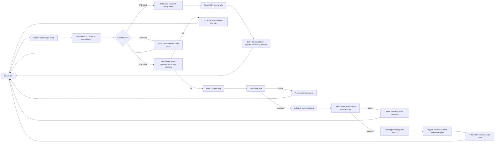
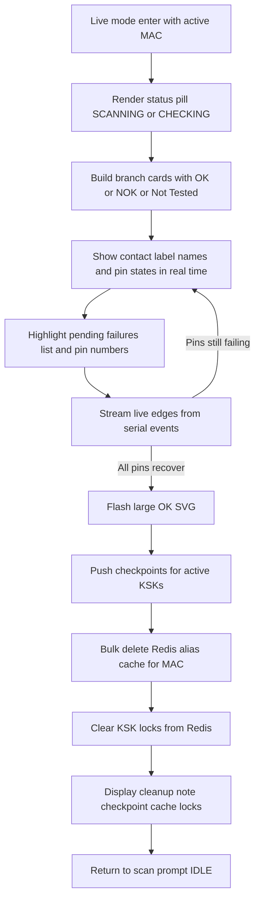
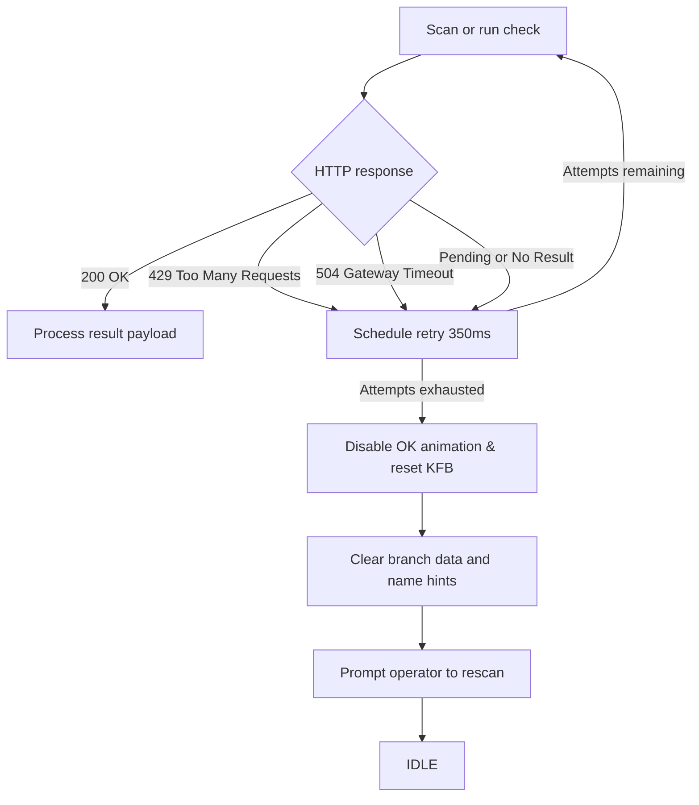
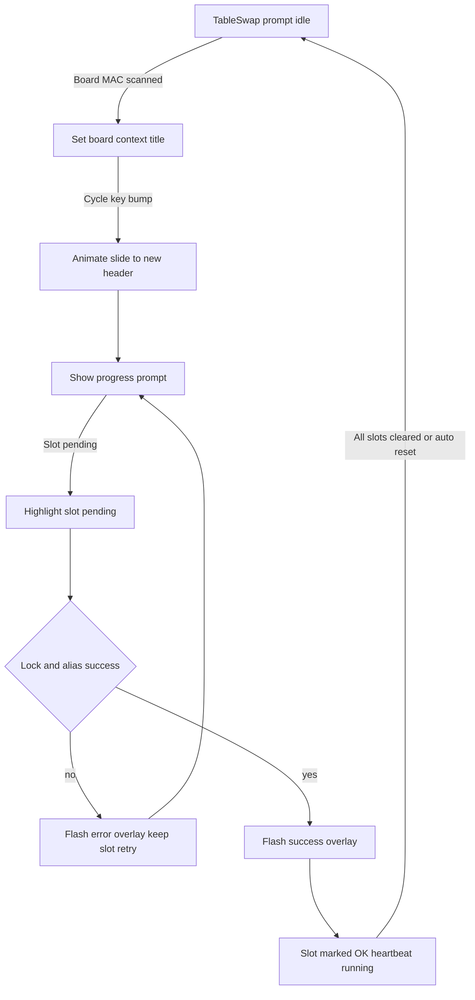

# Wireless KFB GUI

Kompakt állomásalkalmazás KFB panelek (MAC) szkenneléséhez, KSK előkészítéshez és CHECK ellenőrzésekhez. Next.js App Router + Electron, Redis háttértárral.

> **Nyelvválasztó**  
> 🇬🇧 Angol dokumentáció: [1. Setup](https://github.com/projects-kssk/Wireless_KFB_Project/blob/main/docs/EN/1-SETUP.md) → [2. Main Application](https://github.com/projects-kssk/Wireless_KFB_Project/blob/main/docs/EN/2-MAINAPPLICATION.md) → [3. Process Flow](https://github.com/projects-kssk/Wireless_KFB_Project/blob/main/docs/EN/3-PROCESS-FLOW.md) → [4. Troubleshooting](https://github.com/projects-kssk/Wireless_KFB_Project/blob/main/docs/EN/4-ERRORS.md) → [5. Scenarios](https://github.com/projects-kssk/Wireless_KFB_Project/blob/main/docs/EN/5-SCENARIOS.md) → [6. ESP firmware](https://github.com/projects-kssk/Wireless_KFB_Project/blob/main/docs/EN/6-ESP-PLATFORMIO.md)  
> 🇭🇺 Magyar összefoglalók: [1. Setup](https://github.com/projects-kssk/Wireless_KFB_Project/blob/main/docs/HU/1-Setup-HU.md) → [2. MainApplicationUI](https://github.com/projects-kssk/Wireless_KFB_Project/blob/main/docs/HU/2-MainApplication-HU.md) → [3. Folyamat összefoglaló](https://github.com/projects-kssk/Wireless_KFB_Project/blob/main/docs/HU/3-Process-Flow-HU.md) → [4. Hibakeresés](https://github.com/projects-kssk/Wireless_KFB_Project/blob/main/docs/HU/4-Errors-HU.md) → [5. Forgatókönyvek](https://github.com/projects-kssk/Wireless_KFB_Project/blob/main/docs/HU/5-Scenarios-HU.md) → [6. ESP firmware](https://github.com/projects-kssk/Wireless_KFB_Project/blob/main/docs/HU/6-ESP-PLATFORMIO-HU.md)

---

## Fő funkciók
- Vonalkód olvasás: külön porton a Dashboard (ACM0) és a Setup (ACM1).
- ESP kommunikáció: CHECK/MONITOR és ESP programozás automatikus visszajelzéssel.
- Redis integráció: aliasok, pinek, KSK lockok és Krosy checkpoint tárolása.
- Krosy XML feldolgozás: Setup oldalon pin → alias megfeleltetés és opcionális checkpoint.
- Teljesen kliensmentes állapotkezelés (nincs localStorage).

## Gyors indulás
1. Telepítsd a függőségeket: `npm install`
2. Indíts Redis-t (`npm run redis:up` vagy külső szerver).
3. `npm run dev` – Next.js + Node szerver + Electron együtt indul.
4. Setup: `http://localhost:3000/setup` · Dashboard: `http://localhost:3000/`

### Hasznos parancsok
- `npm run predev` – Redis konténer felhúzása és readiness várakozás
- `npm run dev` – teljes fejlesztői stack
- `npm run build` – AppImage build (x86_64)
- `npm run build:arm64` – AppImage ARM64
- `npm run lint` · `npm run type-check` – kódellenőrzés

## Contributor Onboarding
Új fejlesztőknek ajánlott áttekinteni a [AGENTS.md](./AGENTS.md) "Repository Guidelines" dokumentumot.
Összefoglalja a könyvtárstruktúrát, fő parancsokat, kódstílust és PR elvárásokat, így gyorsítja a belépést és az ellenőrzési folyamatot.

## MainApplicationUI Scan Scenarios

```mermaid
%%{init: {'flowchart': {'nodeSpacing': 90, 'rankSpacing': 140}, 'themeVariables': {'fontSize': '18px'}}}%%
flowchart LR
    A[IDLE: Scan Prompt] --> S[Scanner ACM0 event]
    S -->|Run check may retrigger| B{Setup data present?}
    B -- No --> B1[Show no setup data banner\nClear scanned code\nReady for immediate retry] --> A

    B -- Yes --> C{Failures or unknown pins?}

    C -- Yes --> LM0
    subgraph Live_Mode [LIVE MODE]
        direction TB
        LM0[Enter live view]
        LM1[Render status pill]
        LM2[Display branch cards]
        LM3[Highlight pending failures]
        LM4[Stream serial edges]
        LM0 --> LM1 --> LM2 --> LM3 --> LM4
        LM4 -->|Pins still failing| LM2
    end
    LM4 -->|All pins recovered| F0

    C -- No --> F0

    subgraph Finalize_Cleanup [FINALIZE & CLEANUP]
        direction LR
        F0[Begin finalize sequence] --> F1[Send checkpoints for active KSKs]
        F1 --> F2[Clear Redis alias cache]
        F2 --> F3[Clear KSK locks]
        F3 --> F4[Flash OK SVG]
        F4 --> F5[Reset UI to IDLE]
    end
    F5 --> A

    %% Error path
    A -.->|Errors 429 504 Pending during scan| R0[Auto-retry loop]
    R0 -->|Retry success| R1[Re-run check]
    R1 --> C
    R0 -->|Retries exhausted| R2[Reset KFB context\nClear branch data\nShow retry prompt]
    R2 --> A
```

[Full-size SVG](https://mermaid.ink/svg/%25%25%7Binit%3A%20%7B%27flowchart%27%3A%20%7B%27nodeSpacing%27%3A%2090%2C%20%27rankSpacing%27%3A%20140%7D%2C%20%27themeVariables%27%3A%20%7B%27fontSize%27%3A%20%2718px%27%7D%7D%7D%25%25%0Aflowchart%20LR%0A%20%20%20%20A%5BIDLE%3A%20Scan%20Prompt%5D%20--%3E%20S%5BScanner%20ACM0%20event%5D%0A%20%20%20%20S%20--%3E%7CRun%20check%20may%20retrigger%7C%20B%7BSetup%20data%20present%3F%7D%0A%20%20%20%20B%20--%20No%20--%3E%20B1%5BShow%20no%20setup%20data%20banner%5CnClear%20scanned%20code%5CnReady%20for%20immediate%20retry%5D%20--%3E%20A%0A%0A%20%20%20%20B%20--%20Yes%20--%3E%20C%7BFailures%20or%20unknown%20pins%3F%7D%0A%0A%20%20%20%20C%20--%20Yes%20--%3E%20LM0%0A%20%20%20%20subgraph%20Live_Mode%20%5BLIVE%20MODE%5D%0A%20%20%20%20%20%20%20%20direction%20TB%0A%20%20%20%20%20%20%20%20LM0%5BEnter%20live%20view%5D%0A%20%20%20%20%20%20%20%20LM1%5BRender%20status%20pill%5D%0A%20%20%20%20%20%20%20%20LM2%5BDisplay%20branch%20cards%5D%0A%20%20%20%20%20%20%20%20LM3%5BHighlight%20pending%20failures%5D%0A%20%20%20%20%20%20%20%20LM4%5BStream%20serial%20edges%5D%0A%20%20%20%20%20%20%20%20LM0%20--%3E%20LM1%20--%3E%20LM2%20--%3E%20LM3%20--%3E%20LM4%0A%20%20%20%20%20%20%20%20LM4%20--%3E%7CPins%20still%20failing%7C%20LM2%0A%20%20%20%20end%0A%20%20%20%20LM4%20--%3E%7CAll%20pins%20recovered%7C%20F0%0A%0A%20%20%20%20C%20--%20No%20--%3E%20F0%0A%0A%20%20%20%20subgraph%20Finalize_Cleanup%20%5BFINALIZE%20%26%20CLEANUP%5D%0A%20%20%20%20%20%20%20%20direction%20LR%0A%20%20%20%20%20%20%20%20F0%5BBegin%20finalize%20sequence%5D%20--%3E%20F1%5BSend%20checkpoints%20for%20active%20KSKs%5D%0A%20%20%20%20%20%20%20%20F1%20--%3E%20F2%5BClear%20Redis%20alias%20cache%5D%0A%20%20%20%20%20%20%20%20F2%20--%3E%20F3%5BClear%20KSK%20locks%5D%0A%20%20%20%20%20%20%20%20F3%20--%3E%20F4%5BFlash%20OK%20SVG%5D%0A%20%20%20%20%20%20%20%20F4%20--%3E%20F5%5BReset%20UI%20to%20IDLE%5D%0A%20%20%20%20end%0A%20%20%20%20F5%20--%3E%20A%0A%0A%20%20%20%20%25%25%20Error%20path%0A%20%20%20%20A%20-.-%3E%7CErrors%20429%20504%20Pending%20during%20scan%7C%20R0%5BAuto-retry%20loop%5D%0A%20%20%20%20R0%20--%3E%7CRetry%20success%7C%20R1%5BRe-run%20check%5D%0A%20%20%20%20R1%20--%3E%20C%0A%20%20%20%20R0%20--%3E%7CRetries%20exhausted%7C%20R2%5BReset%20KFB%20context%5CnClear%20branch%20data%5CnShow%20retry%20prompt%5D%0A%20%20%20%20R2%20--%3E%20A%0A)

1. INPUT: Scan or run check for a MAC/KFB without any setup aliases/pins -> OUTPUT: UI shows `No setup data available for this MAC`, clears the scanned code, and returns to IDLE so the operator can retry immediately.
2. INPUT: Scan or run check returns failures/unknown pin data -> OUTPUT: Live mode stays active, streaming real-time pin edges with contact labels and a pending-failures list until all errors clear; once recovered it falls through to the finalize sequence.
2.1 INPUT: BranchDashboardMainContent enters live mode with active MAC -> OUTPUT: Renders status pill (`SCANNING`/`CHECKING`), builds branch cards with OK/NOK/Not Tested badges, highlights pending pins, flashes a large OK SVG once the pins recover, pushes checkpoints for active KSKs, clears Redis aliases and locks, shows the cleanup note, then returns to the scan prompt.
3. INPUT: Scan or run check finishes with no failures and setup data present -> OUTPUT: Finalize sequence runs (checkpoints → alias purge → lock clear), flashes the OK SVG, surfaces the cleanup note, and resets the UI for the next device.
4. INPUT: Scan or run check hits errors like 429/504/pending -> OUTPUT: Flow auto-retries with scheduled backoff; if retries succeed it rejoins the normal flow, otherwise it disables the OK animation, resets the KFB context, clears branch data, and prompts another attempt.

### Setup Page Flow (ACM1)

[Full-size SVG](https://mermaid.ink/svg/%25%25%7Binit%3A%20%7B%27flowchart%27%3A%20%7B%27nodeSpacing%27%3A%2085%2C%20%27rankSpacing%27%3A%20130%7D%2C%20%27themeVariables%27%3A%20%7B%27fontSize%27%3A%20%2717px%27%7D%7D%7D%25%25%0Aflowchart%20LR%0A%20%20%20%20S0%5BSetup%20idle%5D%20--%3E%20S1%5BAcquire%20scan%20scope%20setup%5D%0A%20%20%20%20S1%20--%3E%20S2%5BScanner%20ACM1%20event%20or%20manual%20input%5D%0A%20%20%20%20S2%20--%3E%20T%7BClassify%20code%7D%0A%0A%20%20%20%20T%20--%20KFB%20MAC%20--%3E%20K0%5BSet%20board%20MAC%20and%20setup%20name%5D%0A%20%20%20%20K0%20--%3E%20K1%5BReset%20KSK%20slots%20to%20idle%5D%0A%20%20%20%20K1%20--%3E%20K2%5BStart%2060s%20countdown%20update%20TableSwap%20header%5D%0A%20%20%20%20K2%20--%3E%20S0%0A%0A%20%20%20%20T%20--%20KSK%20serial%20--%3E%20P0%5BPre%20checks%20board%20scanned%20duplicates%20capacity%5D%0A%20%20%20%20P0%20--%20fail%20--%3E%20PF%5BShow%20panel%20error%20keep%20slot%20idle%5D%20--%3E%20S0%0A%20%20%20%20P0%20--%20ok%20--%3E%20P1%5BMark%20slot%20pending%5D%0A%20%20%20%20P1%20--%3E%20P2%5BPOST%20ksk%20lock%5D%0A%20%20%20%20P2%20--%20failure%20--%3E%20P3%5BRevert%20slot%20show%20error%5D%20--%3E%20S0%0A%20%20%20%20P2%20--%20success%20--%3E%20P4%5BAdd%20lock%20start%20heartbeat%5D%0A%20%20%20%20P4%20--%3E%20P5%5BLoad%20aliases%20prefer%20Redis%20fallback%20Krosy%5D%0A%20%20%20%20P5%20--%20failure%20--%3E%20P6%5BMark%20slot%20error%20toast%20message%5D%20--%3E%20S0%0A%20%20%20%20P5%20--%20success%20--%3E%20P7%5BPersist%20pin%20map%20update%20slot%20OK%5D%0A%20%20%20%20P7%20--%3E%20P8%5BTrigger%20TableSwap%20flash%20increment%20cycle%5D%0A%20%20%20%20P8%20--%3E%20P9%5BIf%20three%20OK%20schedule%20auto%20reset%5D%0A%20%20%20%20P9%20--%3E%20S0%0A%0A%20%20%20%20T%20--%20Unknown%20--%3E%20U0%5BShow%20unrecognized%20code%20error%5D%20--%3E%20S0%0A)

### LIVE Mode Internals (Scenario 2.1)

[Full-size SVG](https://mermaid.ink/svg/flowchart%20TB%0A%20%20%20%20L0%5BLive%20mode%20enter%20with%20active%20MAC%5D%20--%3E%20L1%5BRender%20status%20pill%20SCANNING%20or%20CHECKING%5D%0A%20%20%20%20L1%20--%3E%20L2%5BBuild%20branch%20cards%20with%20OK%20or%20NOK%20or%20Not%20Tested%5D%0A%20%20%20%20L2%20--%3E%20L3%5BShow%20contact%20label%20names%20and%20pin%20states%20in%20real%20time%5D%0A%20%20%20%20L3%20--%3E%20L4%5BHighlight%20pending%20failures%20list%20and%20pin%20numbers%5D%0A%20%20%20%20L4%20--%3E%20L5%5BStream%20live%20edges%20from%20serial%20events%5D%0A%20%20%20%20L5%20--%3E%7CPins%20still%20failing%7C%20L3%0A%20%20%20%20L5%20--%3E%7CAll%20pins%20recover%7C%20L6%5BFlash%20large%20OK%20SVG%5D%0A%20%20%20%20L6%20--%3E%20L7%5BPush%20checkpoints%20for%20active%20KSKs%5D%0A%20%20%20%20L7%20--%3E%20L8%5BBulk%20delete%20Redis%20alias%20cache%20for%20MAC%5D%0A%20%20%20%20L8%20--%3E%20L9%5BClear%20KSK%20locks%20from%20Redis%5D%0A%20%20%20%20L9%20--%3E%20L10%5BDisplay%20cleanup%20note%20checkpoint%20cache%20locks%5D%0A%20%20%20%20L10%20--%3E%20L11%5BReturn%20to%20scan%20prompt%20IDLE%5D%0A)

### Error and Retry Handling (Scenario 4)

[Full-size SVG](https://mermaid.ink/svg/flowchart%20TB%0A%20%20%20%20R0%5BScan%20or%20run%20check%5D%20--%3E%20R1%7BHTTP%20response%7D%0A%20%20%20%20R1%20--%20200%20OK%20--%3E%20R3%5BProcess%20result%20payload%5D%0A%20%20%20%20R1%20--%20429%20Too%20Many%20Requests%20--%3E%20R2%5BSchedule%20retry%20350ms%5D%0A%20%20%20%20R1%20--%20504%20Gateway%20Timeout%20--%3E%20R2%0A%20%20%20%20R1%20--%20Pending%20or%20No%20Result%20--%3E%20R2%0A%20%20%20%20R2%20--%3E%7CAttempts%20remaining%7C%20R0%0A%20%20%20%20R2%20--%3E%7CAttempts%20exhausted%7C%20R4%5BDisable%20OK%20animation%20%26%20reset%20KFB%5D%0A%20%20%20%20R4%20--%3E%20R5%5BClear%20branch%20data%20and%20name%20hints%5D%0A%20%20%20%20R5%20--%3E%20R6%5BPrompt%20operator%20to%20rescan%5D%20--%3E%20R7%5BIDLE%5D%0A)

### TableSwap Flow

[Full-size SVG](https://mermaid.ink/svg/flowchart%20TB%0A%20%20%20%20T0%5BTableSwap%20prompt%20idle%5D%20--%3E%7CBoard%20MAC%20scanned%7C%20T1%5BSet%20board%20context%20title%5D%0A%20%20%20%20T1%20--%3E%7CCycle%20key%20bump%7C%20T2%5BAnimate%20slide%20to%20new%20header%5D%0A%20%20%20%20T2%20--%3E%20T3%5BShow%20progress%20prompt%5D%0A%20%20%20%20T3%20--%3E%7CSlot%20pending%7C%20T4%5BHighlight%20slot%20pending%5D%0A%20%20%20%20T4%20--%3E%20T5%7BLock%20and%20alias%20success%7D%0A%20%20%20%20T5%20--%20no%20--%3E%20T6%5BFlash%20error%20overlay%20keep%20slot%20retry%5D%0A%20%20%20%20T6%20--%3E%20T3%0A%20%20%20%20T5%20--%20yes%20--%3E%20T7%5BFlash%20success%20overlay%5D%0A%20%20%20%20T7%20--%3E%20T8%5BSlot%20marked%20OK%20heartbeat%20running%5D%0A%20%20%20%20T8%20--%3E%7CAll%20slots%20cleared%20or%20auto%20reset%7C%20T0%0A)

### TableSwap Flow

## Kulcs környezeti változók (részletek a doksiban)

| Téma | Példa változók | Részletes leírás |
|------|----------------|------------------|
| **ESP** | `ESP_TTY_PATH`, `ESP_BAUD`, `ESP_HEALTH_PROBE`, `ESP_PING_CMD` | [EN](https://github.com/projects-kssk/Wireless_KFB_Project/blob/main/docs/EN/2-MAINAPPLICATION.md) · [HU](https://github.com/projects-kssk/Wireless_KFB_Project/blob/main/docs/HU/2-MainApplication-HU.md) |
| **Scannerek** | `SCANNER_TTY_PATHS`, `NEXT_PUBLIC_SCANNER_INDEX_DASHBOARD`, `NEXT_PUBLIC_SCANNER_INDEX_SETUP` | [EN](https://github.com/projects-kssk/Wireless_KFB_Project/blob/main/docs/EN/2-MAINAPPLICATION.md) · [HU](https://github.com/projects-kssk/Wireless_KFB_Project/blob/main/docs/HU/2-MainApplication-HU.md) |
| **Setup/Krosy** | `NEXT_PUBLIC_KROSY_ONLINE`, `NEXT_PUBLIC_KROSY_URL_ONLINE`, `NEXT_PUBLIC_KSK_TTL_SEC` | [EN](https://github.com/projects-kssk/Wireless_KFB_Project/blob/main/docs/EN/1-SETUP.md) · [HU](https://github.com/projects-kssk/Wireless_KFB_Project/blob/main/docs/HU/1-Setup-HU.md) |
| **Redis / Lockok** | `REDIS_URL`, `KSK_REQUIRE_REDIS`, `KSK_DEFAULT_TTL_SEC`, `NEXT_PUBLIC_KSK_REQUIRE_REDIS` | [EN](https://github.com/projects-kssk/Wireless_KFB_Project/blob/main/docs/EN/1-SETUP.md) |
| **Workflow** | `CHECK_SEND_MODE`, `NEXT_PUBLIC_SCANNER_POLL_IF_STALE_MS`, `NEXT_PUBLIC_FINALIZED_RESCAN_BLOCK_MS` | [EN](https://github.com/projects-kssk/Wireless_KFB_Project/blob/main/docs/EN/3-PROCESS-FLOW.md) |
| **Naplózás** | `LOG_VERBOSE`, `LOG_ENABLE`, `LOG_TAG_LEVELS`, `LOG_MONITOR_ONLY` | [EN](https://github.com/projects-kssk/Wireless_KFB_Project/blob/main/docs/EN/4-ERRORS.md) |
| **ESP firmware** | `ESPNOW_CHANNEL`, MCP címek, debounce konstansok | [EN](https://github.com/projects-kssk/Wireless_KFB_Project/blob/main/docs/EN/6-ESP-PLATFORMIO.md) · [HU](https://github.com/projects-kssk/Wireless_KFB_Project/blob/main/docs/HU/6-ESP-PLATFORMIO-HU.md) |

## Ajánlott olvasási sorrend

1. **Setup / Előkészítés**  
   - 🇬🇧 [docs/EN/1-SETUP.md](https://github.com/projects-kssk/Wireless_KFB_Project/blob/main/docs/EN/1-SETUP.md)  
   - 🇭🇺 [docs/HU/1-Setup-HU.md](https://github.com/projects-kssk/Wireless_KFB_Project/blob/main/docs/HU/1-Setup-HU.md)
2. **Main Application / Dashboard**  
   - 🇬🇧 [docs/EN/2-MAINAPPLICATION.md](https://github.com/projects-kssk/Wireless_KFB_Project/blob/main/docs/EN/2-MAINAPPLICATION.md)  
   - 🇭🇺 [docs/HU/2-MainApplication-HU.md](https://github.com/projects-kssk/Wireless_KFB_Project/blob/main/docs/HU/2-MainApplication-HU.md)
3. **Teljes folyamat leírása**  
   - 🇬🇧 [docs/EN/3-PROCESS-FLOW.md](https://github.com/projects-kssk/Wireless_KFB_Project/blob/main/docs/EN/3-PROCESS-FLOW.md)  
   - 🇭🇺 [docs/HU/3-Process-Flow-HU.md](https://github.com/projects-kssk/Wireless_KFB_Project/blob/main/docs/HU/3-Process-Flow-HU.md)
4. **Hibakeresés**  
   - 🇬🇧 [docs/EN/4-ERRORS.md](https://github.com/projects-kssk/Wireless_KFB_Project/blob/main/docs/EN/4-ERRORS.md)  
   - 🇭🇺 [docs/HU/4-Errors-HU.md](https://github.com/projects-kssk/Wireless_KFB_Project/blob/main/docs/HU/4-Errors-HU.md)
5. **További forgatókönyvek / javaslatok**  
   - 🇬🇧 [docs/EN/5-SCENARIOS.md](https://github.com/projects-kssk/Wireless_KFB_Project/blob/main/docs/EN/5-SCENARIOS.md)  
   - 🇭🇺 [docs/HU/5-Scenarios-HU.md](https://github.com/projects-kssk/Wireless_KFB_Project/blob/main/docs/HU/5-Scenarios-HU.md)
6. **ESP firmware (PlatformIO projektek)**  
   - 🇬🇧 [docs/EN/6-ESP-PLATFORMIO.md](https://github.com/projects-kssk/Wireless_KFB_Project/blob/main/docs/EN/6-ESP-PLATFORMIO.md)  
   - 🇭🇺 [docs/HU/6-ESP-PLATFORMIO-HU.md](https://github.com/projects-kssk/Wireless_KFB_Project/blob/main/docs/HU/6-ESP-PLATFORMIO-HU.md)

## Naplózás és ellenőrzés
- `LOG_VERBOSE=1` → fájl naplók (`logs/app.log`, `.krosy-logs/...`).
- Hibák mindig bekerülnek a `logs/errors.log` fájlba.
- Konzol üzenetek: `MONITOR start/ok`, `CHECK fail`, Redis figyelmeztetések.

## Gyakori hibák
- **Nem indul a scan**: ellenőrizd a scanner portot az SSE streamben (`/api/serial/events`).
- **CHECK timeout**: vizsgáld meg az ESP kábelt, `ESP_TTY_PATH` értéket, próbáld `ESP_DEBUG=1`-gyel.
- **Lock beragad**: `DELETE /api/ksk-lock?mac=...&force=1`, majd frissítsd a Setup oldalt.
- **Alias hiányzik**: futtasd `POST /api/aliases/rehydrate`, ellenőrizd `GET /api/aliases?mac=...&all=1` választ.

---

## Projekt felépítése (röviden)
- `src/app/` – Next.js oldalak és API route-ok (App Router)
- `src/components/` – UI komponensek (PascalCase)
- `src/lib/` – osztott segédfüggvények (serial, redis, logger)
- `main/` – Electron főfolyamat
- `server.ts`, `dist-server/` – Node szerver belépési pont + build
- `logs/` (pl. `app.log`, `errors.log`), `.krosy-logs/` – naplók

## Támogatás
Kérdés esetén nézd át a [docs/EN/4-ERRORS.md](https://github.com/projects-kssk/Wireless_KFB_Project/blob/main/docs/EN/4-ERRORS.md) útmutatót, vagy jelezd a csapatnak a konkrét hibát/napló részlettel.
Telefonos elérhetőség: 621.
The project was made by Nagy Viktor.
