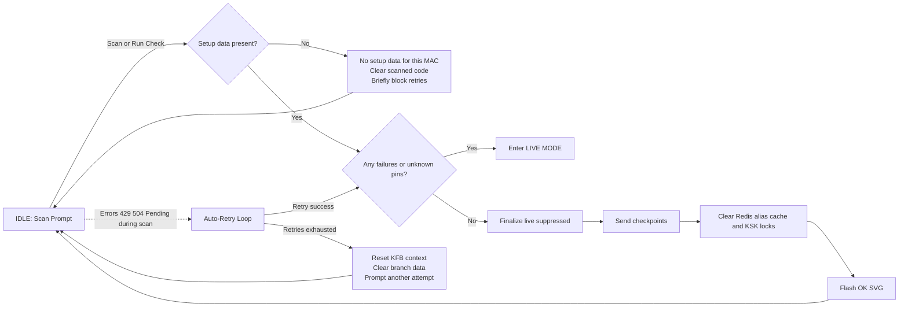
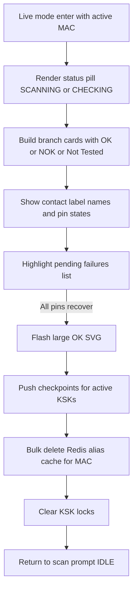
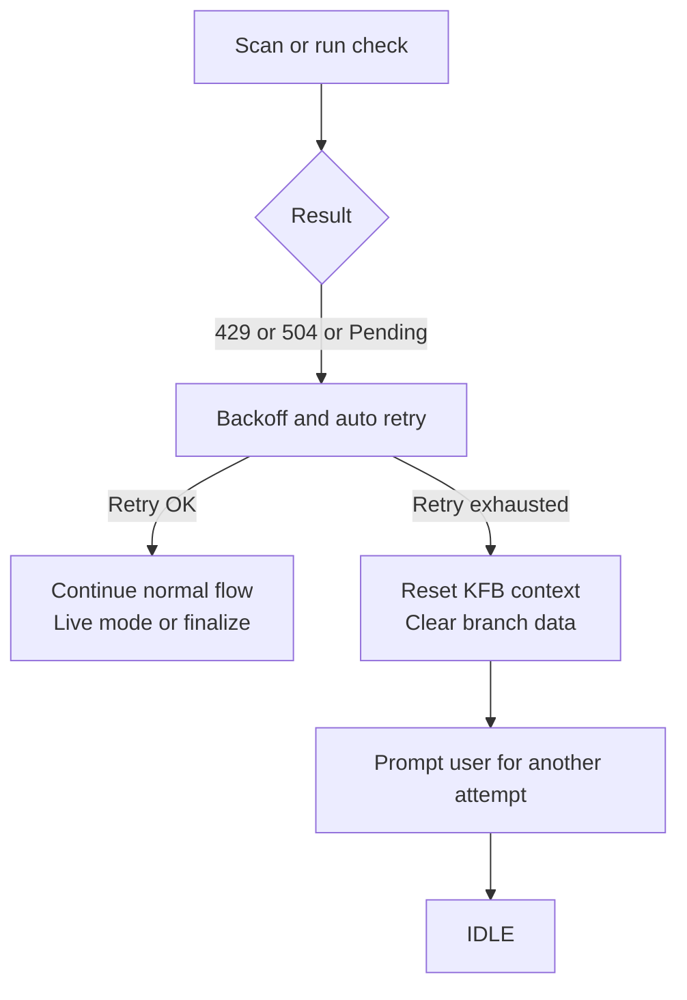

# Wireless KFB GUI

Kompakt állomásalkalmazás KFB panelek (MAC) szkenneléséhez, KSK előkészítéshez és CHECK ellenőrzésekhez. Next.js App Router + Electron, Redis háttértárral.

> **Nyelvválasztó**  
> 🇬🇧 Angol dokumentáció: [1. Setup](https://github.com/projects-kssk/Wireless_KFB_Project/blob/main/docs/EN/1-SETUP.md) → [2. Main Application](https://github.com/projects-kssk/Wireless_KFB_Project/blob/main/docs/EN/2-MAINAPPLICATION.md) → [3. Process Flow](https://github.com/projects-kssk/Wireless_KFB_Project/blob/main/docs/EN/3-PROCESS-FLOW.md) → [4. Troubleshooting](https://github.com/projects-kssk/Wireless_KFB_Project/blob/main/docs/EN/4-ERRORS.md) → [5. Scenarios](https://github.com/projects-kssk/Wireless_KFB_Project/blob/main/docs/EN/5-SCENARIOS.md) → [6. ESP firmware](https://github.com/projects-kssk/Wireless_KFB_Project/blob/main/docs/EN/6-ESP-PLATFORMIO.md)  
> 🇭🇺 Magyar összefoglalók: [1. Setup](https://github.com/projects-kssk/Wireless_KFB_Project/blob/main/docs/HU/1-Setup-HU.md) → [2. MainApplicationUI](https://github.com/projects-kssk/Wireless_KFB_Project/blob/main/docs/HU/2-MainApplication-HU.md) → [3. Folyamat összefoglaló](https://github.com/projects-kssk/Wireless_KFB_Project/blob/main/docs/HU/3-Process-Flow-HU.md) → [4. Hibakeresés](https://github.com/projects-kssk/Wireless_KFB_Project/blob/main/docs/HU/4-Errors-HU.md) → [5. Forgatókönyvek](https://github.com/projects-kssk/Wireless_KFB_Project/blob/main/docs/HU/5-Scenarios-HU.md) → [6. ESP firmware](https://github.com/projects-kssk/Wireless_KFB_Project/blob/main/docs/HU/6-ESP-PLATFORMIO-HU.md)

---

## Fő funkciók
- Vonalkód olvasás: külön porton a Dashboard (ACM0) és a Setup (ACM1).
- ESP kommunikáció: CHECK/MONITOR és ESP programozás automatikus visszajelzéssel.
- Redis integráció: aliasok, pinek, KSK lockok és Krosy checkpoint tárolása.
- Krosy XML feldolgozás: Setup oldalon pin → alias megfeleltetés és opcionális checkpoint.
- Teljesen kliensmentes állapotkezelés (nincs localStorage).

## Gyors indulás
1. Telepítsd a függőségeket: `npm install`
2. Indíts Redis-t (`npm run redis:up` vagy külső szerver).
3. `npm run dev` – Next.js + Node szerver + Electron együtt indul.
4. Setup: `http://localhost:3000/setup` · Dashboard: `http://localhost:3000/`

### Hasznos parancsok
- `npm run predev` – Redis konténer felhúzása és readiness várakozás
- `npm run dev` – teljes fejlesztői stack
- `npm run build` – AppImage build (x86_64)
- `npm run build:arm64` – AppImage ARM64
- `npm run lint` · `npm run type-check` – kódellenőrzés

## Contributor Onboarding
Új fejlesztőknek ajánlott áttekinteni a [AGENTS.md](./AGENTS.md) "Repository Guidelines" dokumentumot.
Összefoglalja a könyvtárstruktúrát, fő parancsokat, kódstílust és PR elvárásokat, így gyorsítja a belépést és az ellenőrzési folyamatot.

## MainApplicationUI Scan Scenarios

1. INPUT: Scan or run check for a MAC/KFB without any setup aliases/pins -> OUTPUT: UI shows `No setup data available for this MAC`, clears the scanned code, blocks retries briefly, and idles.
2. INPUT: Scan or run check returns failures/unknown pin data -> OUTPUT: Live mode stays active, showing contact label names and pin statuses so the operator can inspect issues in real time.
2.1 INPUT: BranchDashboardMainContent enters live mode with active MAC -> OUTPUT: Renders status pill (`SCANNING`/`CHECKING`), builds branch cards with OK/NOK/Not Tested badges, highlights pending failures list, flashes large OK SVG when all pins recover, pushes checkpoints for the active KSKs, bulk-deletes the Redis alias cache entries for that MAC, clears the KSK locks, then returns to the scan prompt idle view.
3. INPUT: Scan or run check finishes with no failures and setup data present -> OUTPUT: Live mode is suppressed, finalize sends checkpoints for the active KSKs, clears the Redis alias cache and KSK locks, flashes the OK SVG confirmation, and then resets the UI for the next device.
4. INPUT: Scan or run check hits errors like 429/504/pending -> OUTPUT: Flow retries automatically; after retries are exhausted it resets the KFB context, clears branch data, and prompts another attempt.

### LIVE Mode Internals (Scenario 2.1)

### Error and Retry Handling (Scenario 4)

## Kulcs környezeti változók (részletek a doksiban)

| Téma | Példa változók | Részletes leírás |
|------|----------------|------------------|
| **ESP** | `ESP_TTY_PATH`, `ESP_BAUD`, `ESP_HEALTH_PROBE`, `ESP_PING_CMD` | [EN](https://github.com/projects-kssk/Wireless_KFB_Project/blob/main/docs/EN/2-MAINAPPLICATION.md) · [HU](https://github.com/projects-kssk/Wireless_KFB_Project/blob/main/docs/HU/2-MainApplication-HU.md) |
| **Scannerek** | `SCANNER_TTY_PATHS`, `NEXT_PUBLIC_SCANNER_INDEX_DASHBOARD`, `NEXT_PUBLIC_SCANNER_INDEX_SETUP` | [EN](https://github.com/projects-kssk/Wireless_KFB_Project/blob/main/docs/EN/2-MAINAPPLICATION.md) · [HU](https://github.com/projects-kssk/Wireless_KFB_Project/blob/main/docs/HU/2-MainApplication-HU.md) |
| **Setup/Krosy** | `NEXT_PUBLIC_KROSY_ONLINE`, `NEXT_PUBLIC_KROSY_URL_ONLINE`, `NEXT_PUBLIC_KSK_TTL_SEC` | [EN](https://github.com/projects-kssk/Wireless_KFB_Project/blob/main/docs/EN/1-SETUP.md) · [HU](https://github.com/projects-kssk/Wireless_KFB_Project/blob/main/docs/HU/1-Setup-HU.md) |
| **Redis / Lockok** | `REDIS_URL`, `KSK_REQUIRE_REDIS`, `KSK_DEFAULT_TTL_SEC`, `NEXT_PUBLIC_KSK_REQUIRE_REDIS` | [EN](https://github.com/projects-kssk/Wireless_KFB_Project/blob/main/docs/EN/1-SETUP.md) |
| **Workflow** | `CHECK_SEND_MODE`, `NEXT_PUBLIC_SCANNER_POLL_IF_STALE_MS`, `NEXT_PUBLIC_FINALIZED_RESCAN_BLOCK_MS` | [EN](https://github.com/projects-kssk/Wireless_KFB_Project/blob/main/docs/EN/3-PROCESS-FLOW.md) |
| **Naplózás** | `LOG_VERBOSE`, `LOG_ENABLE`, `LOG_TAG_LEVELS`, `LOG_MONITOR_ONLY` | [EN](https://github.com/projects-kssk/Wireless_KFB_Project/blob/main/docs/EN/4-ERRORS.md) |
| **ESP firmware** | `ESPNOW_CHANNEL`, MCP címek, debounce konstansok | [EN](https://github.com/projects-kssk/Wireless_KFB_Project/blob/main/docs/EN/6-ESP-PLATFORMIO.md) · [HU](https://github.com/projects-kssk/Wireless_KFB_Project/blob/main/docs/HU/6-ESP-PLATFORMIO-HU.md) |

## Ajánlott olvasási sorrend

1. **Setup / Előkészítés**  
   - 🇬🇧 [docs/EN/1-SETUP.md](https://github.com/projects-kssk/Wireless_KFB_Project/blob/main/docs/EN/1-SETUP.md)  
   - 🇭🇺 [docs/HU/1-Setup-HU.md](https://github.com/projects-kssk/Wireless_KFB_Project/blob/main/docs/HU/1-Setup-HU.md)
2. **Main Application / Dashboard**  
   - 🇬🇧 [docs/EN/2-MAINAPPLICATION.md](https://github.com/projects-kssk/Wireless_KFB_Project/blob/main/docs/EN/2-MAINAPPLICATION.md)  
   - 🇭🇺 [docs/HU/2-MainApplication-HU.md](https://github.com/projects-kssk/Wireless_KFB_Project/blob/main/docs/HU/2-MainApplication-HU.md)
3. **Teljes folyamat leírása**  
   - 🇬🇧 [docs/EN/3-PROCESS-FLOW.md](https://github.com/projects-kssk/Wireless_KFB_Project/blob/main/docs/EN/3-PROCESS-FLOW.md)  
   - 🇭🇺 [docs/HU/3-Process-Flow-HU.md](https://github.com/projects-kssk/Wireless_KFB_Project/blob/main/docs/HU/3-Process-Flow-HU.md)
4. **Hibakeresés**  
   - 🇬🇧 [docs/EN/4-ERRORS.md](https://github.com/projects-kssk/Wireless_KFB_Project/blob/main/docs/EN/4-ERRORS.md)  
   - 🇭🇺 [docs/HU/4-Errors-HU.md](https://github.com/projects-kssk/Wireless_KFB_Project/blob/main/docs/HU/4-Errors-HU.md)
5. **További forgatókönyvek / javaslatok**  
   - 🇬🇧 [docs/EN/5-SCENARIOS.md](https://github.com/projects-kssk/Wireless_KFB_Project/blob/main/docs/EN/5-SCENARIOS.md)  
   - 🇭🇺 [docs/HU/5-Scenarios-HU.md](https://github.com/projects-kssk/Wireless_KFB_Project/blob/main/docs/HU/5-Scenarios-HU.md)
6. **ESP firmware (PlatformIO projektek)**  
   - 🇬🇧 [docs/EN/6-ESP-PLATFORMIO.md](https://github.com/projects-kssk/Wireless_KFB_Project/blob/main/docs/EN/6-ESP-PLATFORMIO.md)  
   - 🇭🇺 [docs/HU/6-ESP-PLATFORMIO-HU.md](https://github.com/projects-kssk/Wireless_KFB_Project/blob/main/docs/HU/6-ESP-PLATFORMIO-HU.md)

## Naplózás és ellenőrzés
- `LOG_VERBOSE=1` → fájl naplók (`logs/app.log`, `.krosy-logs/...`).
- Hibák mindig bekerülnek a `logs/errors.log` fájlba.
- Konzol üzenetek: `MONITOR start/ok`, `CHECK fail`, Redis figyelmeztetések.

## Gyakori hibák
- **Nem indul a scan**: ellenőrizd a scanner portot az SSE streamben (`/api/serial/events`).
- **CHECK timeout**: vizsgáld meg az ESP kábelt, `ESP_TTY_PATH` értéket, próbáld `ESP_DEBUG=1`-gyel.
- **Lock beragad**: `DELETE /api/ksk-lock?mac=...&force=1`, majd frissítsd a Setup oldalt.
- **Alias hiányzik**: futtasd `POST /api/aliases/rehydrate`, ellenőrizd `GET /api/aliases?mac=...&all=1` választ.

---

## Projekt felépítése (röviden)
- `src/app/` – Next.js oldalak és API route-ok (App Router)
- `src/components/` – UI komponensek (PascalCase)
- `src/lib/` – osztott segédfüggvények (serial, redis, logger)
- `main/` – Electron főfolyamat
- `server.ts`, `dist-server/` – Node szerver belépési pont + build
- `logs/` (pl. `app.log`, `errors.log`), `.krosy-logs/` – naplók

## Támogatás
Kérdés esetén nézd át a [docs/EN/4-ERRORS.md](https://github.com/projects-kssk/Wireless_KFB_Project/blob/main/docs/EN/4-ERRORS.md) útmutatót, vagy jelezd a csapatnak a konkrét hibát/napló részlettel.
Telefonos elérhetőség: 621.
The project was made by Nagy Viktor.
