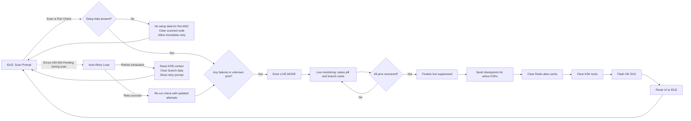
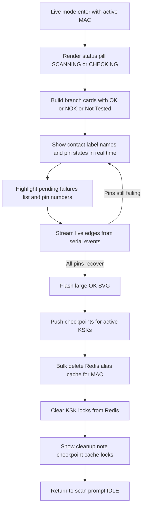

# MainApplicationUI Scan Scenarios



1. INPUT: Scan or run check for a MAC/KFB without any setup aliases/pins -> OUTPUT: UI shows `No setup data available for this MAC`, clears the scanned code, and returns to IDLE so the operator can retry immediately.
2. INPUT: Scan or run check returns failures/unknown pin data -> OUTPUT: Live mode stays active, streaming real-time pin edges with contact labels and a pending-failures list until all errors clear; once recovered it falls through to the finalize sequence.
2.1 INPUT: BranchDashboardMainContent enters live mode with active MAC -> OUTPUT: Renders status pill (`SCANNING`/`CHECKING`), builds branch cards with OK/NOK/Not Tested badges, highlights pending pins, flashes a large OK SVG once the pins recover, pushes checkpoints for active KSKs, clears Redis aliases and locks, shows the cleanup note, then returns to the scan prompt.
3. INPUT: Scan or run check finishes with no failures and setup data present -> OUTPUT: Finalize sequence runs (checkpoints → alias purge → lock clear), flashes the OK SVG, surfaces the cleanup note, and resets the UI for the next device.
4. INPUT: Scan or run check hits errors like 429/504/pending -> OUTPUT: Flow auto-retries with scheduled backoff; if retries succeed it rejoins the normal flow, otherwise it disables the OK animation, resets the KFB context, clears branch data, and prompts another attempt.

## Additional Diagrams

### LIVE Mode Internals (Scenario 2.1)



### Error and Retry Handling (Scenario 4)

```mermaid
flowchart TB
    R0[Scan or run check] --> R1{HTTP response}
    R1 -- 200 OK --> R3[Process result payload]
    R1 -- 429 Too Many Requests --> R2[Schedule retry (350ms)]
    R1 -- 504 Gateway Timeout --> R2
    R1 -- Pending/No Result --> R2
    R2 -->|Attempts remaining| R0
    R2 -->|Attempts exhausted| R4[Disable OK animation & reset KFB]
    R4 --> R5[Clear branch data and name hints]
    R5 --> R6[Prompt operator to rescan] --> R7[IDLE]
```
