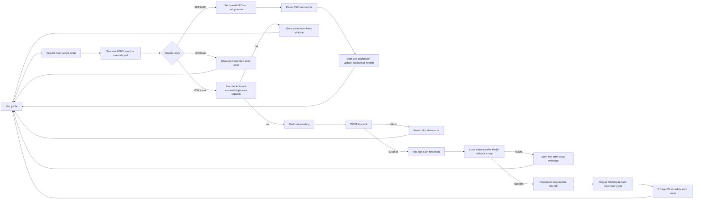
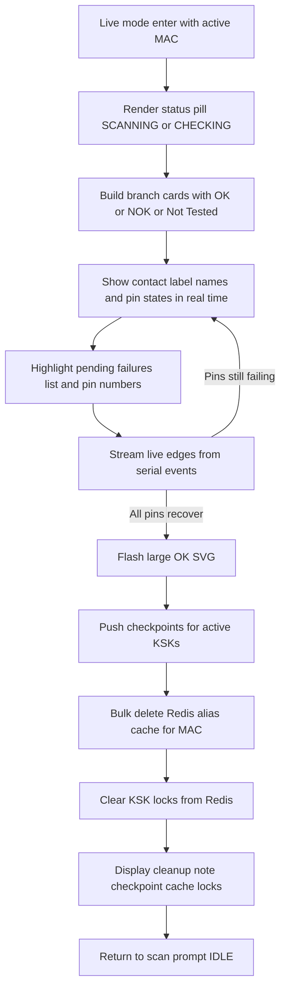
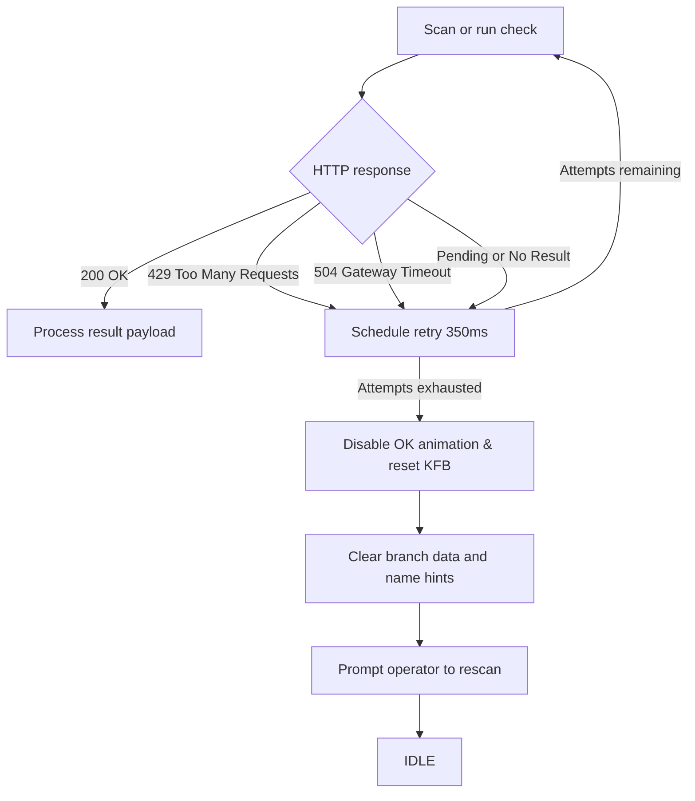
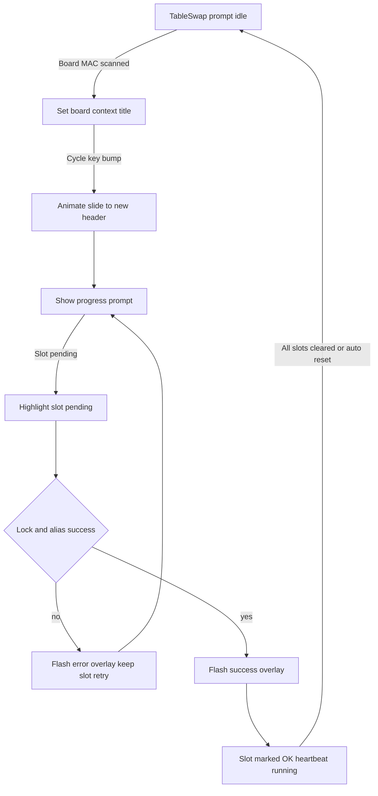

# MainApplicationUI Scan Scenarios

```mermaid
%%{init: {'flowchart': {'nodeSpacing': 90, 'rankSpacing': 140}, 'themeVariables': {'fontSize': '18px'}}}%%
flowchart LR
    A[IDLE: Scan Prompt] --> S[Scanner ACM0 event]
    S -->|Run check may retrigger| B{Setup data present?}
    B -- No --> B1[Show no setup data banner\nClear scanned code\nReady for immediate retry] --> A

    B -- Yes --> C{Failures or unknown pins?}

    %% Live-mode branch
    C -- Yes --> LM0
    subgraph Live_Mode [LIVE MODE]
        direction TB
        LM0[Enter live view]
        LM1[Render status pill]
        LM2[Display branch cards]
        LM3[Highlight pending failures]
        LM4[Stream serial edges]
        LM0 --> LM1 --> LM2 --> LM3 --> LM4
        LM4 -->|Pins still failing| LM2
    end
    LM4 -->|All pins recovered| F0

    %% Finalize path when setup ready and no failures
    C -- No --> F0

    subgraph Finalize_Cleanup [FINALIZE & CLEANUP]
        direction LR
        F0[Begin finalize sequence] --> F1[Send checkpoints for active KSKs]
        F1 --> F2[Clear Redis alias cache]
        F2 --> F3[Clear KSK locks]
        F3 --> F4[Flash OK SVG]
        F4 --> F5[Reset UI to IDLE]
    end
    F5 --> A

    %% Error path
    A -.->|Errors 429 504 Pending during scan| R0[Auto-retry loop]
    R0 -->|Retry success| R1[Re-run check]
    R1 --> C
    R0 -->|Retries exhausted| R2[Reset KFB context\nClear branch data\nShow retry prompt]
    R2 --> A
```

1. INPUT: Scan or run check for a MAC/KFB without any setup aliases/pins -> OUTPUT: UI shows `No setup data available for this MAC`, clears the scanned code, and returns to IDLE so the operator can retry immediately.
2. INPUT: Scan or run check returns failures/unknown pin data -> OUTPUT: Live mode stays active, streaming real-time pin edges with contact labels and a pending-failures list until all errors clear; once recovered it falls through to the finalize sequence.
   2.1 INPUT: BranchDashboardMainContent enters live mode with active MAC -> OUTPUT: Renders status pill (`SCANNING`/`CHECKING`), builds branch cards with OK/NOK/Not Tested badges, highlights pending pins, flashes a large OK SVG once the pins recover, pushes checkpoints for active KSKs, clears Redis aliases and locks, shows the cleanup note, then returns to the scan prompt.
3. INPUT: Scan or run check finishes with no failures and setup data present -> OUTPUT: Finalize sequence runs (checkpoints → alias purge → lock clear), flashes the OK SVG, surfaces the cleanup note, and resets the UI for the next device.
4. INPUT: Scan or run check hits errors like 429/504/pending -> OUTPUT: Scheduler queues bounded retries (default 350 ms backoff); any successful retry drops back into the normal flow, while exhausting the retry budget disables the OK flash, clears branch/alias state, resets the KFB context to IDLE, and surfaces a retry prompt so the operator must rescan.

## Additional Diagrams

### Setup Page Flow (ACM1)

### LIVE Mode Internals (Scenario 2.1)

### Error and Retry Handling (Scenario 4)

### TableSwap Flow

### TableSwap Flow

