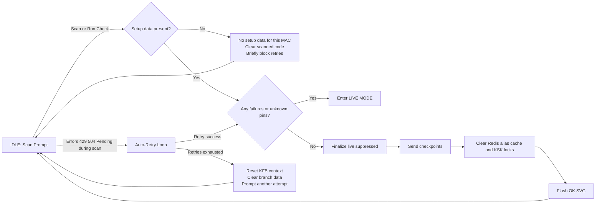
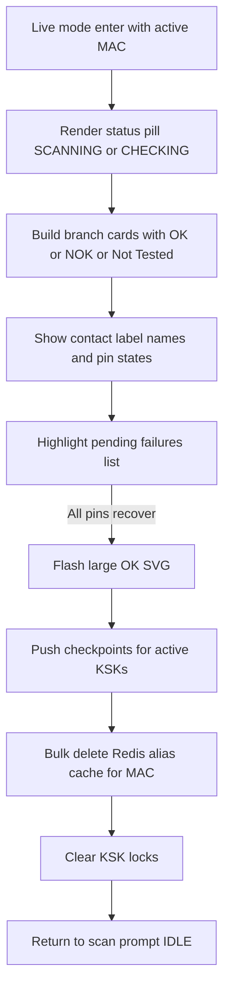
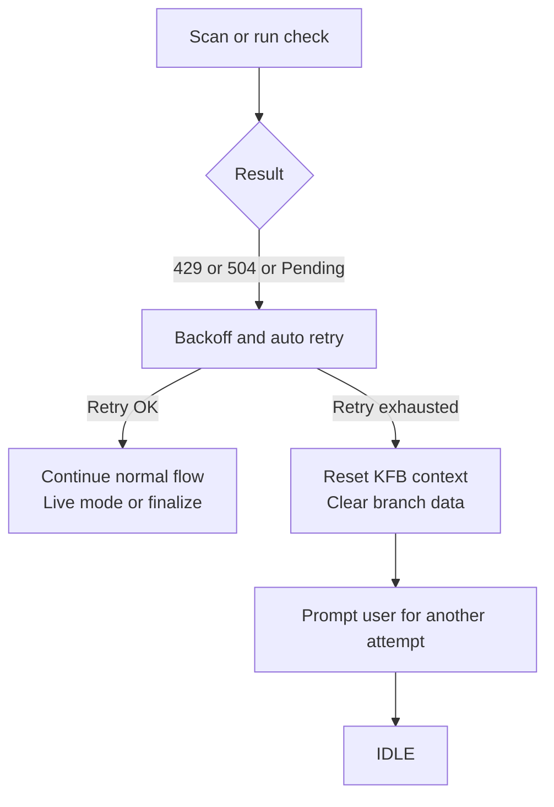

# MainApplicationUI Scan Scenarios

1. INPUT: Scan or run check for a MAC/KFB without any setup aliases/pins -> OUTPUT: UI shows `No setup data available for this MAC`, clears the scanned code, blocks retries briefly, and idles.
2. INPUT: Scan or run check returns failures/unknown pin data -> OUTPUT: Live mode stays active, showing contact label names and pin statuses so the operator can inspect issues in real time.
2.1 INPUT: BranchDashboardMainContent enters live mode with active MAC -> OUTPUT: Renders status pill (`SCANNING`/`CHECKING`), builds branch cards with OK/NOK/Not Tested badges, highlights pending failures list, flashes large OK SVG when all pins recover, pushes checkpoints for the active KSKs, bulk-deletes the Redis alias cache entries for that MAC, clears the KSK locks, then returns to the scan prompt idle view.
3. INPUT: Scan or run check finishes with no failures and setup data present -> OUTPUT: Live mode is suppressed, finalize sends checkpoints for the active KSKs, clears the Redis alias cache and KSK locks, flashes the OK SVG confirmation, and then resets the UI for the next device.
4. INPUT: Scan or run check hits errors like 429/504/pending -> OUTPUT: Flow retries automatically; after retries are exhausted it resets the KFB context, clears branch data, and prompts another attempt.

## Additional Diagrams

### LIVE Mode Internals (Scenario 2.1)

### Error and Retry Handling (Scenario 4)

