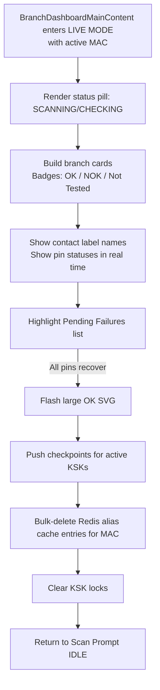

# MainApplicationUI Scan Scenarios

```mermaid
flowchart LR
    A[IDLE: Scan Prompt] -->|Scan or Run Check| B{Setup data present?}
    B -- No --> B1[No setup data for this MAC<br/>Clear scanned code<br/>Briefly block retries] --> A

    B -- Yes --> C{Any failures or unknown pins?}
    C -- Yes --> D[Enter LIVE MODE]
    C -- No  --> E[Finalize live suppressed]<br/>E
    E --> E1[Send checkpoints]
    E1 --> E2[Clear Redis alias cache and KSK locks]
    E2 --> E3[Flash OK SVG]
    E3 --> A

    %% Error path
    A -.->|Errors 429/504/Pending during scan| F[Auto-Retry Loop]
    F -->|Retry success| C
    F -->|Retries exhausted| G[Reset KFB context<br/>Clear branch data<br/>Prompt another attempt] --> A
```

1. INPUT: Scan or run check for a MAC/KFB without any setup aliases/pins -> OUTPUT: UI shows `No setup data available for this MAC`, clears the scanned code, blocks retries briefly, and idles.
2. INPUT: Scan or run check returns failures/unknown pin data -> OUTPUT: Live mode stays active, showing contact label names and pin statuses so the operator can inspect issues in real time.
2.1 INPUT: BranchDashboardMainContent enters live mode with active MAC -> OUTPUT: Renders status pill (`SCANNING`/`CHECKING`), builds branch cards with OK/NOK/Not Tested badges, highlights pending failures list, flashes large OK SVG when all pins recover, pushes checkpoints for the active KSKs, bulk-deletes the Redis alias cache entries for that MAC, clears the KSK locks, then returns to the scan prompt idle view.
3. INPUT: Scan or run check finishes with no failures and setup data present -> OUTPUT: Live mode is suppressed, finalize sends checkpoints for the active KSKs, clears the Redis alias cache and KSK locks, flashes the OK SVG confirmation, and then resets the UI for the next device.
4. INPUT: Scan or run check hits errors like 429/504/pending -> OUTPUT: Flow retries automatically; after retries are exhausted it resets the KFB context, clears branch data, and prompts another attempt.

Got it—here are three clean flow diagrams (Mermaid) that match your scenarios, with **IDLE as the first box** and the flows branching as you described.

### 1) High-Level Flow (Idle → Live → Finalize/Reset + No-Setup + Errors)

```mermaid
flowchart LR
    A[IDLE: Scan Prompt] -->|Scan/Run Check| B{Setup data present?}
    B -- No --> B1[UI: "No setup data for this MAC"\n• Clear scanned code\n• Briefly block retries] --> A

    B -- Yes --> C{Any failures or unknown pins?}
    C -- Yes --> D[Enter LIVE MODE]
    C -- No  --> E[Finalize (Live suppressed)\n• Send checkpoints for active KSKs\n• Clear Redis alias cache & KSK locks\n• Flash OK SVG] --> A

    %% Error path
    A -.->|Errors 429/504/Pending during scan| F[Auto-Retry Loop]
    F -->|Retry success| C
    F -->|Retries exhausted| G[Reset KFB context\nClear branch data\nPrompt another attempt] --> A
```

### 2) LIVE MODE Internals (Scenario 2 & 2.1)



### 3) Error & Retry Handling (Scenario 4)

```mermaid
flowchart TB
    R0[Scan/Run Check] --> R1{Result}
    R1 -- 429/504/Pending --> R2[Backoff & Auto-Retry]
    R2 -->|Retry OK| R3[Continue normal flow\n(Live mode or Finalize)]
    R2 -->|Retry fails & exhausted| R4[Reset KFB context\nClear branch data]
    R4 --> R5[Prompt user for another attempt] --> R6[IDLE]
```

If you want these exported as PNGs or a one-pager PDF, say the word and I’ll generate the files.
